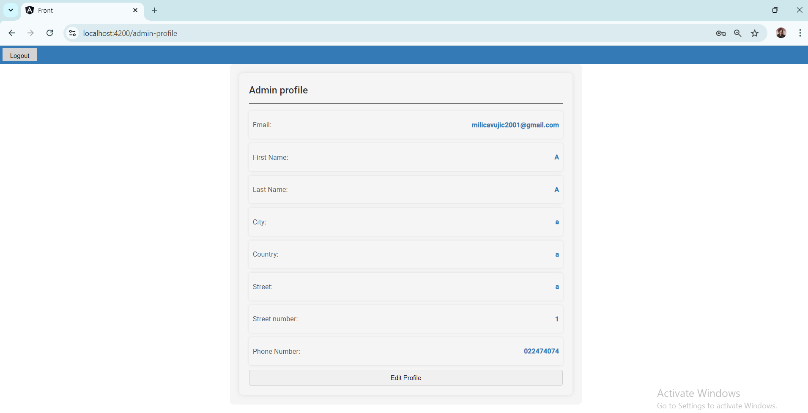

# Marketing Agency Information System

This project is an information system built to manage clients and employees of a marketing agency, with a particular focus on **security** features. The system is developed as part of the course **Security in Electronic Business Systems**, covering various security and functional requirements.

## Tech Stack
- **Backend**: Java 17 (Spring Boot, Spring Security)
- **Frontend**: Angular
- **Database**: PostgreSQL
- **Authentication**: PKI, Multi-factor Authentication (MFA) using Google Authenticator
- **Secure Communication**: HTTPS

## Prerequisites
To run the project, the following are required:
- Java 17
- PostgreSQL
- Node.js (for Angular)
- Google Authenticator app
- SSL certificates for HTTPS

## System Overview
The system manages records for **clients** and **employees** of the marketing agency and includes services for:
- User management (clients and employees)
- Role-based access control (RBAC) system
- PKI-based certificate management
- Multi-factor authentication using OTP
- Secure password storage with bcrypt hashing
- Encrypted data storage for sensitive information
- Real-time monitoring of system logs for security auditing

## Security Features
- **RBAC**: Role-based access control to ensure secure access to resources.
- **Passwordless login**: Integration with public-key infrastructure (PKI) for secure authentication without passwords.
- **Rate-limiting**: To prevent abuse by controlling request rates for different service tiers.
- **User Activity Logging**: Logs user activities to support auditing and detect security issues.
- **Penetration Testing**: Regular testing to identify and mitigate vulnerabilities.
- **GDPR Compliance**: Ensures the system adheres to data protection regulations.
- **HTTPS**: All communication is encrypted using SSL/TLS to ensure confidentiality and integrity.

## Getting Started
1. Clone the repository:
    ```bash
    git clone https://github.com/MilicaVujic/bsep_web_app.git
    ```
2. Set up the backend:
    - Install Java 17
    - Configure PostgreSQL and create the necessary databases
    - Generate SSL certificates for HTTPS
3. Set up the frontend:
    - Install Node.js
    - Navigate to the `frontend` folder and run:
        ```bash
        npm install
        npm start
        ```

## Contributors
- **Milica Vujić** 

- **Other Contributors:**
- Anja Lovrić
- Ivana Kovačević
- Anja Dučić


## Some pages

-
-
-
-
-
-


